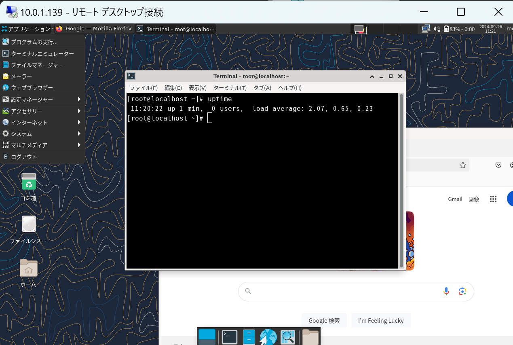

# make-rocky-bootable

`make-rocky-bootable` allows for the easy creation of custom bootable ISO images. :)



## Languages
- [English (英語)](README/README_EN.md)
- [Japanese (日本語)](README/README_JP.md)

## Table of Contents
- [make-rocky-bootable](#make-rocky-bootable)
  - [Languages](#languages)
  - [Table of Contents](#table-of-contents)
  - [Requirements](#requirements)
  - [Usage](#usage)
  - [Benefits of make-rocky-bootable](#benefits-of-make-rocky-bootable)
  - [Important Notes Before Using the Created ISO](#important-notes-before-using-the-created-iso)

## Requirements

- A Rocky Linux 9 system with virtualization (KVM) enabled
  (Other than Rocky Linux 9, it has not been tested, but it might work on EL8 or later compatible OS.)
- `qemu-kvm`
- `lorax`
- `lorax-lmc-virt`

## Usage

1. **Run make-rocky-bootable**
    ```sh
    # git clone https://github.com/lezoid/make-rocky-bootable.git
    # cd make-rocky-bootable
    # ./build.sh --help
    Usage: ./build2.sh [--boot-mode MODE] [--help]
    
    Options:
     --boot-mode MODE     Specify the boot mode: 'uefi', 'mbr', 'uefi_gui', or 'mbr_gui'.
                       - uefi: Uses kickstart/uefi_main.ks (default)
                       - mbr: Uses kickstart/mbr_main.ks
                       - uefi_gui: Uses kickstart/uefi_gui.ks
                       - mbr_gui: Uses kickstart/mbr_gui.ks
     --help               Display this help message.
    # ./build.sh
    ```

    Basically, just running `build.sh` will generate the bootable ISO.
    The output will be in the `build-iso` directory with UEFI support.
    If you want to create a GUI-supported image, specify `--boot-mode` with either `uefi_gui` or `mbr_gui`.
    
    Even in UEFI mode, the image can boot on BIOS-configured machines.
    If you don't need EFI support, use `--boot-mode` with `mbr` or `mbr_gui` to create an ISO without EFI-related packages or files.

2. **Settings**
   1. Add packages (Edit Kickstart)
    ```text
    By editing the `%packages` section in kickstart/uefi_*.ks or kickstart/mbr_*.ks, you can add more default packages.
    ```
   2. Change the root password (Edit Kickstart)
    ```text
    You can change the root password by modifying the `rootpw` line in the Kickstart file.
    # root user plain text password settings
    rootpw --plaintext password
    # root user encrypted password setting
    # rootpw --iscrypted $6$randomsalt$encryptedpasswordhash
    ```
   3. Embed custom tools
    ```text
    You can either expand your own files into the root image via Kickstart,
    or use the built-in `/run/initramfs/live/scripts/startup.sh` executed by systemd during boot.
    The scripts directory in the ISO (`/run/initramfs/live/scripts/`) is copied from the `make-rocky-bootable/scripts/` directory during the ISO creation process.
    ```

    ```sh
    [root@image make-rocky-bootable]# ll scripts/  ← This becomes /run/initramfs/live/scripts/
    -rwxr-xr-x. 1 root root 289 Sep 24 17:09  startup.sh ← This file
    ```
    Therefore, even if you are not familiar with Kickstart, you can place your files or scripts in the `scripts/` directory and write your custom processes in `startup.sh`, allowing your own tools or scripts to run during boot.

## Benefits of make-rocky-bootable

- **Embed and Execute Custom Binaries and Scripts**
  The created live DVD executes `/run/initramfs/live/scripts/startup.sh` through systemd at boot.
  This script directory is copied from the `make-rocky-bootable/scripts/` directory during ISO creation.
  
  Even users unfamiliar with Kickstart can easily embed files into the bootable ISO and automatically run custom processes, providing flexible customization options.

- **Create Lightweight GUI Images with RDP Support**
  Many modern default live CDs come with GNOME 3 by default, which can be slow on servers with poor graphical performance due to excessive effect processing.
  
  To address this, `make-rocky-bootable` allows you to generate a lightweight live DVD with XFCE as the default GUI. 
  Additionally, since xrdp is enabled, you can use remote desktop functionality, including clipboard support.

## Important Notes Before Using the Created ISO

- The standard image opens the SSH port and allows root login via the Kickstart file.
- GUI images open both SSH and RDP ports.
- All users, by default, have "password" as their password, as defined in the Kickstart file.
- It is highly recommended that you modify the Kickstart file to set a more complex root password or switch to key-based authentication.
  If you are unfamiliar with Kickstart, you can modify the embedded script (`startup.sh`) to change the password upon boot.
- The bootable ISO is intended for temporary use and is not recommended for environments with open access to many users.
- For the GUI version, RDP and physical graphical logins (through the graphical target) cannot be accessed simultaneously by the same user. Please log out from one session before switching to the other.
