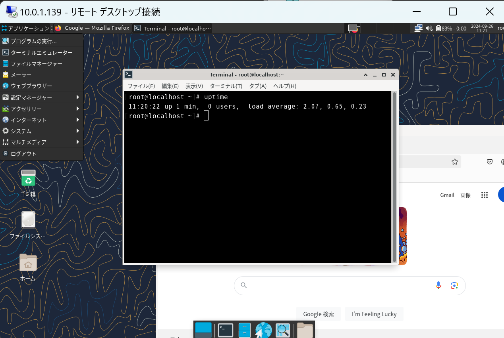
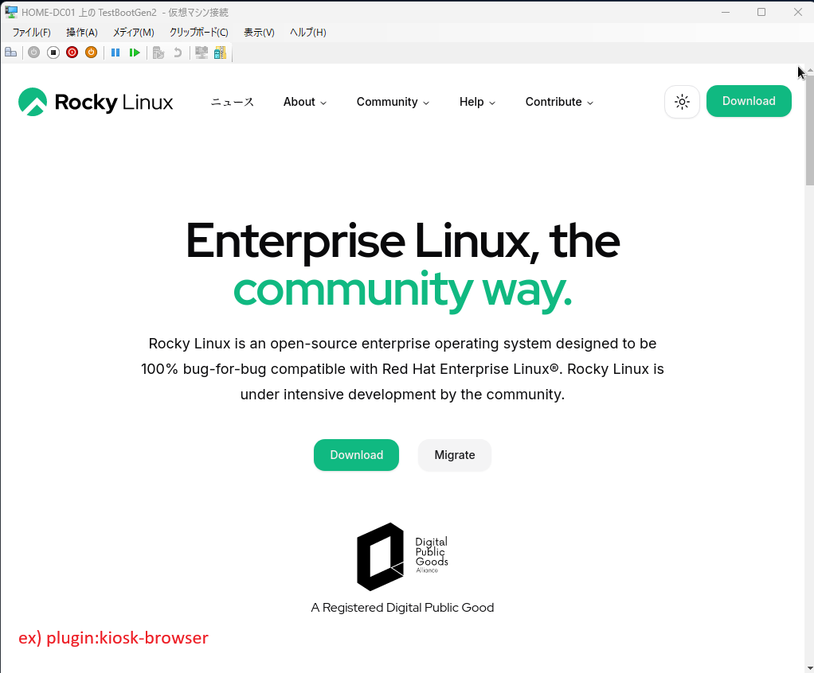

# make-rocky-bootable

応答形式で手軽にカスタムブータブルISOを簡単に作成できるツールです :)

GUIや自前のスクリプトを含むLiveイメージの作成が可能です。

<p align="center">
  
</p>

## 言語
- [英語 (English)](../README.md)
- [日本語 (Japanese)](README_JP.md)

## 目次
- [概要](#概要)
- [動作要件](#動作要件)
- [使い方](#使い方)
- [利用可能なプラグイン](#利用可能なプラグイン)
- [スクリプトやファイルの埋め込み](#スクリプトやファイルの埋め込み)
- [利用前の注意事項](#利用前の注意事項)

---

## 概要

`make-rocky-bootable` はプラグインベースのシステムを採用したRocky Linux用ブータブルISO作成ツールです。
プラグイン機能でカスタマイズを実現しており、例えばGUIの導入やRDPの有効化やスタートアップスクリプトの組み込みをサポートしています。

例えば、kiosk-browserプラグインを使うと、LiveCDで特定ページを全画面ブラウザ環境（kioskモード）を表示させるだけのカスタマイジングもできます。
Web ページを全画面表示する用途のPOSや組み込み端末を作る場合、本来はWindowsベース環境である程度のコストをかけて作る必要があります。
しかしこのプラグインを使うと特定の、コストをかけず容易に実現ができます。
LiveCDの再起動で復旧できますし、HDDも不要のため、運用コストを大きく下げることもできるはずです。

<p align="center">
  
</p>

## ビルド対応OSバージョン

| OS | GUI |
|----|-----|
| Rocky Linux 8 | XFCE + XRDP |
| Rocky Linux 9 | XFCE + XRDP |
| Rocky Linux 10 | KDE Plasma + krdp ⚠️ 実験的 |

> ⚠️ **Rocky Linux 10 + KDE Plasma は実験的サポートです。**
> 仮想化環境（VMware・Hyper-V・VirtualBoxなど）において解像度変更を行うと
> セッションが応答不能になる事象を確認しています。実機環境での利用を推奨します。

---

## 動作要件

ビルドホストは Rocky Linux 8 / 9 / 10 (KVM有効) を推奨します。

**必要パッケージ:**

```sh
dnf install -y qemu-kvm lorax lorax-lmc-virt wget isomd5sum syslinux-nonlinux
```

---

## 使い方

```sh
git clone https://github.com/lezoid/make-rocky-bootable.git
cd make-rocky-bootable
./build.py
```

実行するとTUIが起動し、以下の順に設定を行います。

1. **OSを選択** — Rocky Linux 8 / 9 / 10
2. **プラグインを選択** — インストールする機能をチェックボックスで選択
3. **プラグイン設定** — 選択したプラグインの設定値を入力（ユーザー名・パスワードなど）
4. **rootパスワードを設定**
5. **ブートモードを選択** — UEFI Boot / CSM/BIOS (MBR) Boot
6. **ISO ダウンロード・ビルド** — 自動でISOを取得してビルド

ビルドには **数十分から1時間程度** かかります。完了するとISOが `build-iso/` に出力されます。

### オプション

```sh
./build.py [オプション]

  --debug           デバッグモード: 生成されたkickstartを表示する
  --view-kickstart  kickstartの内容を確認するだけでビルドはしない
  --language LANG   表示言語を強制指定する (例: en, ja)
```

---

## 利用可能なプラグイン

make-rocky-bootable では、プラグイン機能を通じて、LiveCD の機能をカスタマイジングできます。
必須の OS 共通の基本設定プラグインに加えて、ビルド時に選択できる機能プラグインは TUI 形式で選択できます。

### 選択式プラグイン

内蔵のプラグインはビルド時に TUI で選択できます。
「デフォルト」列が ✓ のものは初期状態でチェック済みです。
また一部プラグインはソフトウェアの動作の関係上、依存関係が存在し、依存関係パッケージは自動的に選択がされます。

| プラグイン名 | 概要 | 対応OS | デフォルト | 依存 | 詳細 |
|------------|------|--------|-----------|------|------|
| language-japanese-support | 日本語ロケール・キーボード・タイムゾーン設定 | 全OS | — | — | [→](../docs/plugins/ja/language-japanese-support.md) |
| add-user | 一般ユーザーの作成 + root SSH ログイン無効化 (任意) + startup-user.sh / startup-user-network.sh を初回ログイン時に実行 (任意) | 全OS | — | — | [→](../docs/plugins/ja/add-user.md) |
| add-xfce-gui-support | XFCE デスクトップ + XRDP | Rocky 8, 9 | — | — | [→](../docs/plugins/ja/add-xfce-gui-support.md) |
| xfce-autologin | XFCE デスクトップで指定ユーザーの自動ログインを設定する | Rocky 8, 9 | — | add-xfce-gui-support | [→](../docs/plugins/ja/xfce-autologin.md) |
| add-kde-gui-support | KDE Plasma デスクトップ + krdp (RDP) | Rocky 10 ⚠️ | — | add-user | [→](../docs/plugins/ja/add-kde-gui-support.md) |
| kiosk-browser | OSごとの hardening を含む kiosk ブラウザ環境を構築・設定する | Rocky 8, 9, 10 | — | add-user, add-xfce-gui-support または add-kde-gui-support | [→](../docs/plugins/ja/kiosk-browser.md) |
| firstboot-root-startup | 初回起動時に startup-root.sh (通常) および/または startup-root-network.sh (ネットワーク待機) を root で実行 | 全OS | — | — | [→](../docs/plugins/ja/firstboot-root-startup.md) |
| default-sysprep | システムクリーンアップ (sysprep) | 全OS | ✓ | — | [→](../docs/plugins/ja/default-sysprep.md) |

常時適用プラグインを含む全プラグイン一覧、プラグインの仕組み、独自プラグインの作成方法については、プラグインドキュメントを参照してください。

**[→ プラグインドキュメント (日本語)](../docs/plugins/ja/README.md)**

---

## スクリプトやファイルの埋め込み

`scripts/` 配下のファイルはISO作成時にrootイメージに組み込まれ、
LiveCDとして起動した際には **`/run/initramfs/live/scripts/`** としてアクセスできます。

### リポジトリ上のパス設計

```
リポジトリ上のパス                                    LiveCD上のパス
scripts/                                    →    /run/initramfs/live/scripts/
├── make-rocky-bootable/
│   └── plugins/                            →    /run/initramfs/live/scripts/make-rocky-bootable/plugins/
│       ├── firstboot-root-startup/         →    （firstboot-root-startupプラグイン有効時）
│       │   ├── startup-root.sh            →    .../firstboot-root-startup/startup-root.sh
│       │   └── startup-root-network.sh    →    .../firstboot-root-startup/startup-root-network.sh
│       └── add-user/                       →    （add-userプラグイン有効時）
│           ├── startup-user.sh            →    .../add-user/startup-user.sh
│           └── startup-user-network.sh    →    .../add-user/startup-user-network.sh
└── users/                                  →    /run/initramfs/live/scripts/users/
```

> `make-rocky-bootable/plugins/` 配下はビルド時に動的に生成され、ビルド完了後は自動クリーンアップされます。
> `users/` はユーザーが自由にファイルを配置できるディレクトリです（スタートアップスクリプトから参照するファイルの置き場として利用できます）。

標準で組み込まれているスタートアップスクリプト (`firstboot-root-startup`, `add-user`) は各プラグインの `ISO_DIR/` 以下に配置されています。

```
plugins/features/post/firstboot-root-startup/ISO_DIR/startup-root.sh          # root用テンプレート（通常）
plugins/features/post/firstboot-root-startup/ISO_DIR/startup-root-network.sh  # root用テンプレート（ネットワーク待機）
plugins/features/post/add-user/ISO_DIR/startup-user.sh                        # ユーザー用テンプレート（通常）
plugins/features/post/add-user/ISO_DIR/startup-user-network.sh                # ユーザー用テンプレート（ネットワーク待機）
```

### firstboot-root-startupプラグイン

**初回起動時に root で1回だけ自動実行されます。**

プラグイン設定で2種類のサービスを独立して有効化でき、両方同時に有効にすることも可能です。

| バリアント | サービス名 | スクリプト | 実行タイミング |
|-----------|-----------|-----------|--------------|
| 通常 | `firstboot-root-startup.service` | `startup-root.sh` | `basic.target` 到達後 |
| ネットワーク待機 | `firstboot-root-startup-network.service` | `startup-root-network.sh` | `network-online.target` 到達後 |

```
ログ出力先: /var/log/make-rocky-bootable/firstboot-root-startup.log
```

各サービスは実行後にサービスファイルを自己削除するため、2回目以降の起動では実行されません。

### add-userプラグイン

**一般ユーザーの初回ログイン時に1回だけ自動実行されます。**

プラグイン設定で2種類のサービスを独立して有効化でき、両方同時に有効にすることも可能です。

| バリアント | サービス名 | スクリプト | 実行タイミング |
|-----------|-----------|-----------|--------------|
| 通常 | `firstboot-user-startup.service` | `startup-user.sh` | `default.target` 到達後 |
| ネットワーク待機 | `firstboot-user-startup-network.service` | `startup-user-network.sh` | `network-online.target` 到達後 |

```
ログ出力先: ~/.local/log/make-rocky-bootable/firstboot-user-startup.log
```

Kickstartに不慣れな方でも、これらのスクリプトに処理を追記するだけで
独自ツールの実行やシステム設定の自動化が可能です。

---

## 利用前の注意事項

- 作成されたISOにはビルド時に設定したrootパスワードが含まれています。
- SELinux は `permissive` モードで動作します。
- SSHポートが開放されており、rootログインが許可されています。
- GUIプラグインを有効化した場合はRDPポート (3389) も開放されます。
- **本ISOは一時的な利用を想定しています。不特定多数がアクセスできる環境での利用は推奨しません。**
- KDE版はRDPと物理グラフィカル画面から同一ユーザーで同時ログインすることはできません。
